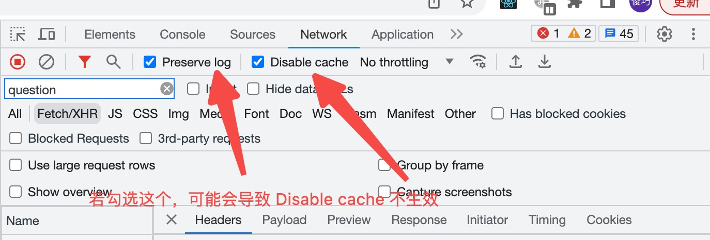

控制台 Request Headers 展示 “provisional headers are shown”, 常见原因

[官方文档: Provisional headers warning](https://developer.chrome.com/docs/devtools/network/reference/?utm_source=devtools#provisional-headers)

#### 原因一：
使用了浏览器缓存，可以尝试打开无痕浏览器. 或者勾选 “Disable Cache”

#### 原因二：
请求资源不合法，例如：fetch("https://jec.fish.com/unknown-url/") in the Console.

