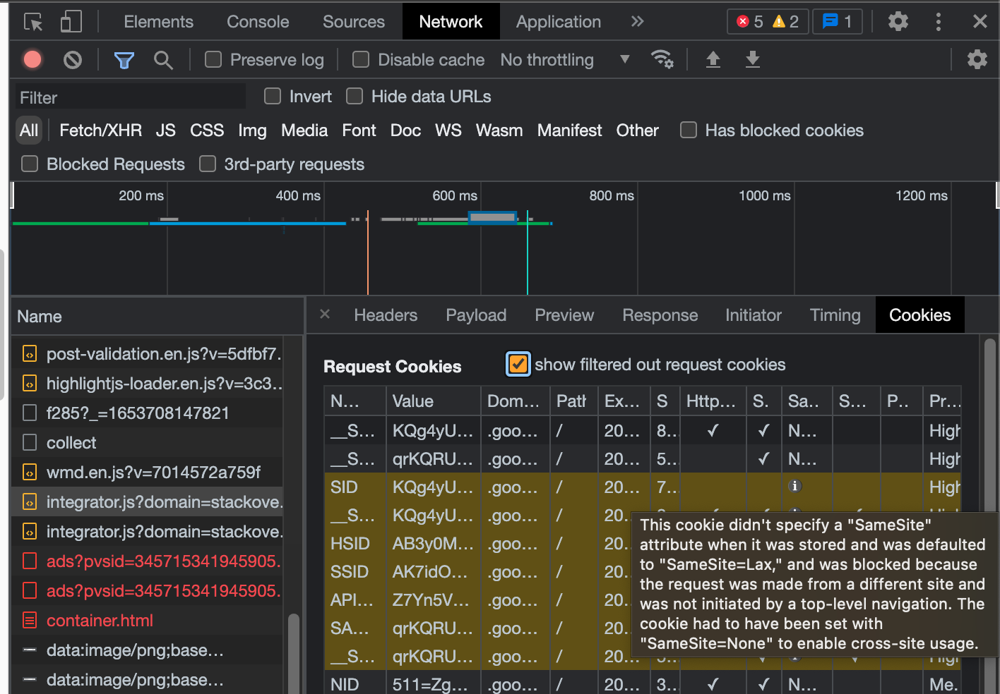
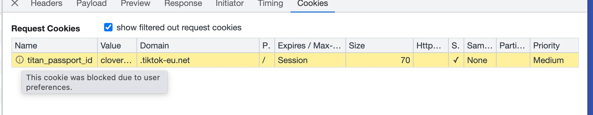

## 背景
通过 cors 解决跨域，前端域名：https://dataleap-ttp-eu.xiaomi.net/ ，API 域名为：
https://dataleap.tiktok-eu.net. 在项目中访问 API 接口时，不能把cookie 带上去，从而导致接口 401、403

## 排查
#### How to tell why a cookie is not being sent:
- Go to network tab, and click the request that is not being sent with your cookie.

- Go to the "Cookies" tab just appeared.

- Check "show filtered out request cookies" to see all the cookies that wasn't sent, they'll appear in yellow.

Then a little "i" label will appear next to the property that is preventing the cookie from being sent. You can hover over to see the detail:


Google Version:  114.0.5735.90


> 参考：https://stackoverflow.com/questions/30877698/how-to-tell-why-a-cookie-is-not-being-sent/63856709#63856709

#### 临时方案
This happens when you might have "Block third-party cookies" enabled in the browser. You can check this in:
```
Settings → Site Settings → Cookies and site data → Block third-party cookies
```
or Also available via:
```
chrome://settings/content/cookies
```
Chnage this setting to "Allow all cookies"

参考：https://www.appsloveworld.com/php/20/how-to-fix-this-set-cookie-was-blocked-due-to-user-preferences-in-chrome-stac