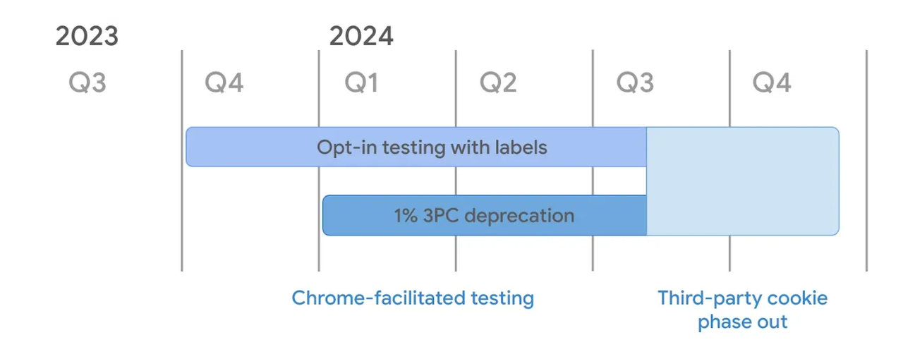
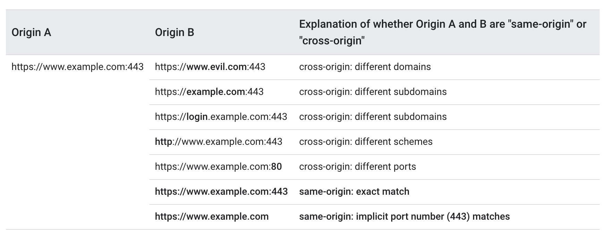
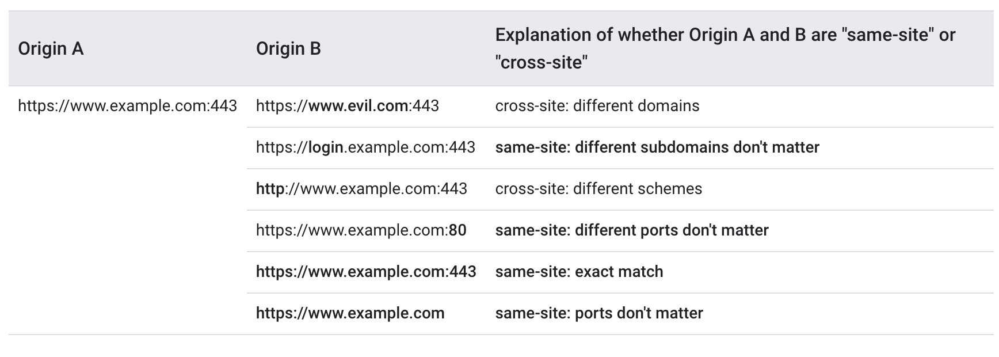

# Chrome schemeful-samesite解决方案

## 背景
为了防止CSRF攻击和用户追踪，Chrome 51开始，浏览器Cookie新增加了一个samesite属性，Chrome 80后将未设置samesite属性的cookie都将其值设为Lax，Chrome 88后，由原来的samesite策略变更为schemeful-samesite，其与samesite的不同之处就是增加了协议一致性的判断
影响

三方 Cookie 为 Web 提供了跨站点跟踪的能力，它的存在为 Web 用户的隐私和安全都带来了巨大威胁。
Chrome 计划从 2024 年第一季度开始对 1% 的用户禁用第三方 Cookie。

然后从 2024 年第三季度开始逐步将禁用范围扩大到 100%。
如果我们的站点现在还在依赖三方 Cookie，需要提前做好迁移方案，不然 2024 Q1 开始线上业务可能会受到影响。

## 哪些属于三方 Cookie
> 所有 “跨站” 请求携带的 Cookie 为三方 Cookie。
注意此处为 “跨站”（cross site） 而非  “跨源” （cross origin），这两个概念是不同的。

下面是 “跨站”（cross site） 和  “跨源” （cross origin）请求的对比：
“跨源” （cross origin）

“跨站”（cross site）

Chrome 发送请求时会附带一个  Sec-Fetch-Site HTTP Header ，通过这个值也可以很好的判定是否为跨站请求。

---
下面是一些可能会用到三方 Cookie 的业务场景：
- 前端端监控：上报的接口为跨站接口，通过三方 Cookie 来存储一个用户标识；
- 统一登录：通过统一的跨站 SSO 接口为网站实现单点登录能力，共享用户身份；
- 广告业务：通过三方 Cookie 存储用户标识，用于进行广告归因或兴趣推荐；
- CSRF ：通过 Cookie 存储 CSRF Token 信息，跨站请求则为三方 Cookie；
- iframe：通用的聊天、地图等 iframe，通过三方 Cookie 来共享一些状态；

目前基本上所有项目都是符合samesite条件的（页面域名和后端服务域名都是以.baidu.com结尾，属于同一个站点），但因为前端提测环境是http的，例如http://fix-bug.one-service.ci.t.pt.baidu.com/，
而后端接口是https的，这就不满足schemeful-samesite的协议一致性的要求了，所以在请求后端接口的时候，浏览器认为这是一个跨站点访问，存在安全隐患，于是samesite属性不为None的cookie都不会发送给服务端，这就导致后端拿不到登录相关的cookie信息，登录验证失败（部分项目会出现页面一直刷新的效果，其原因是因为后端判断未登录后，前端会跳转到cas登录页，但是cas那边其实一直都是已登录的状态，所以又跳回了对应项目，此时后端还是认为未登录，前端又跳转至cas，以此往复，就呈现出了一直刷新页面的视觉效果）

## 解决方案
1. 访问https的提测环境，其实前端提测环境是支持https访问的，例如https://fix-bug.one-service.ci.t.pt.baidu.com/，只不过由于没有安装证书，会出现如下提示，点击高级-》继续前往即可正常访问（由于页面地址变成了https，所以所有接口请求都要保证是https的）。安装前端提测环境对应的一个假证书，即可跳过上面的安全提示，直接进入对应项目，详见证书安装方法（推荐）

2. 复用*.bi.baidu.com的证书，但是需要前端把提测环境的地址由fix-bug.one-service.ci.t.pt.baidu.com更改为例如fix-bug--one-service--ci--t--pt.bi.baidu.com类似的不包含符号"."的地址，且前端服务器需要维护*.bi.baidu.com的证书，具有一定的成本，所以暂时不考虑此方法
3. 浏览器访问chrome://flags/，将Schemeful Same-Site选项改为Disabled（不推荐）

其它
1. 开发人员有本地环境，所以启服务的时候要采用https
