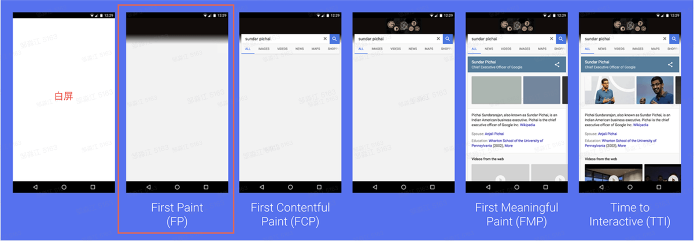
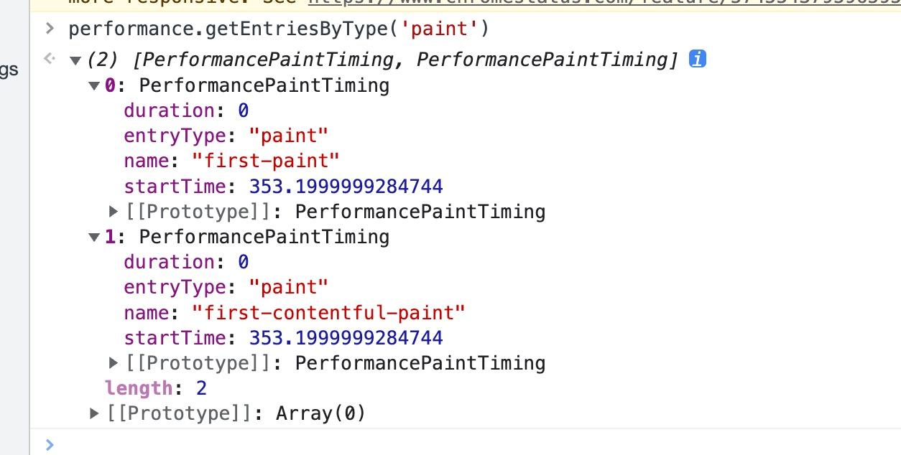

【RUM】如何计算 Web 页面的 FP 指标
什么是 FP 指标
如何获取 FP 指标
同步跳转场景
SPA 切换场景
浏览器兼容性说明
如何优化 FP 指标
【RUM】如何计算 Web 页面的 FP 指标​
本文档详细描述如何计算 Web 页面的 FP 指标​
计算方法作为数据上报的规范参照，Slardar SDK 中 FP 的实现同本文规范对齐​
​
## 什么是 FP 指标​
​
在 什么是以用户为中心的性能指标 中提到，FP (First Paint) 为首次渲染的时间点，在性能统计指标中，从用户开始访问 Web 页面的时间点到 FP 的时间点这段时间可以被视为 白屏时间，也就是说在用户访问 Web 网页的过程中，FP 时间点之前，用户看到的都是没有任何内容的白色屏幕，用户在这个阶段感知不到任何有效的工作在进行。​
​
​

​
​
​
FP 指标通常会反映页面的白屏时间，而白屏时间会反映当前 Web 页面的网络加载性能情况，当加载性能非常良好的情况下，白屏的时间就会越短，用户等待内容的时间就会越短，流失的概率就会降低。​
​
如何获取 FP 指标​
​
用户访问 Web 页面，通常会有两种模式:​
​
直接通过服务端路由切换的同步跳转场景；​
通过客户端路由跳转的 SPA 页面切换场景；​
​
同步跳转场景​
​
通过 W3C Paint Timing 规范草案 中的描述， PerformancePaintTiming  API 可以直接获取当前 Web 页面的绘制性能打点信息，FP 就在其中。​
​
在浏览器实现中，可以通过 performance.getEntriesByType('paint') 方法获取 PerformancePaintTiming API 提供的打点信息，找到 name 为 first-paint 的对象，描述的即为 FP 的指标数据，如下图所示：​

FP 指标不适用​
​
SPA 切换场景，一般页面一直处于有内容状态，首次渲染的概念意义不大，且难以准确定义，因此不上报该指标。​
​
浏览器兼容性说明​
​
FP 指标要求浏览器支持 Paint Timing API，在不兼容的情况下，不上报 FP 指标。​
​
## 如何优化 FP 指标​
​
优化 FP 指标，关键是缩短资源的下载时间，以及减少阻塞浏览器渲染 DOM 的任务的执行时间。常见方法有：​
​
- 减少外链 CSS 资源的数量 。​
- 减少同步加载的外链 JS 资源数量。​
- 合理使用 HTTP 缓存。​
- 压缩静态资源。​
- 优化页面加载过程中的 JS 执行时间。