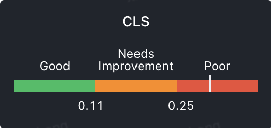
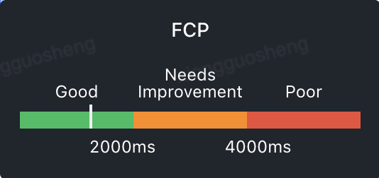
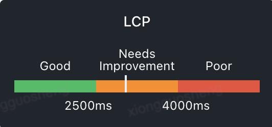
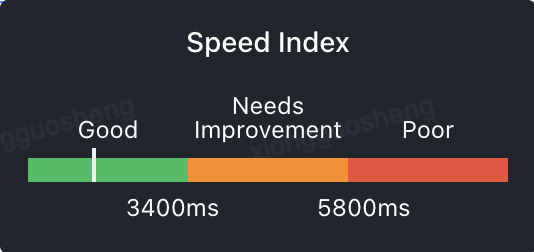
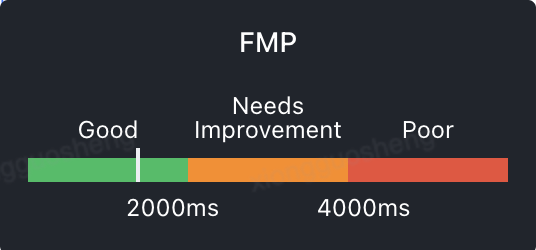
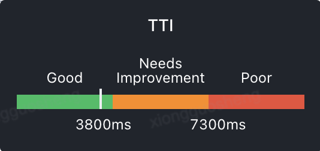
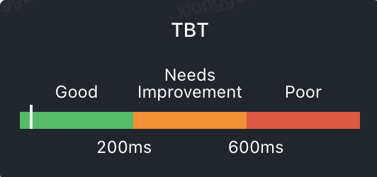

# Cumulative Layout Shift (CLS)
CLS 代表视觉稳定性，根据页面加载过程中视窗所有布局位置有变动的元素数量来计算值（越低越好）。

指标基准线：

# First Contentful Paint (FCP)
FCP 为首次有内容渲染的时间点。也就是浏览器首次加载字体、非白色 canvas 或 svg 图像时。 文档：https://web.dev/fcp/

指标基准图：

首次内容绘制 (FCP) 指标测量页面从开始加载到页面内容的任何部分在屏幕上完成渲染的时间。对于该指标，"内容"指的是文本、图像（包括背景图像）、\<svg>元素或非白色的\<canvas>元素。

#### 怎样算是良好的 FCP 分数？ #
为了提供良好的用户体验，网站应该努力将首次内容绘制控制在1.8 秒或以内。为了确保您能够在大部分用户的访问期间达成建议目标值，一个良好的测量阈值为页面加载的第 75 个百分位数，且该阈值同时适用于移动和桌面设备。

#### 使用
可以使用[web-vitals](https://github.com/GoogleChrome/web-vitals) JavaScript 库来测量 FCP，库会自行处理这些差异（在可能的情况下）

# Largest Contentful Paint (LCP)
LCP 代表在 viewport 中最大的页面元素加载的时间。

指标基准线：

# First Input Delay (FID)
FID 代表首次输入延迟。FID 衡量的是从用户首次与网站进行交互（即当他们单击链接，点击按钮或使用自定义的 JavaScript 驱动的控件）到浏览器实际上能够响应该交互之间的时间。

# Speed Index (SI)
Speed Index 用于衡量衡量页面内容填充的速度。它特别适用于比较不同页面之间的差别。

指标基准线

# First Meaningful Paint (FMP)
FMP 首次有意义渲染耗时，代表页面主体元素首次出现的时间。相较于 FP、FCP 它更强调用户的主观感受，也就是我们通常看到的 “页面加载出来” 的状态。

指标基准线：

# Time to Interactive（TTI）
TTI 可交互时间。它用于标记应用已进行视觉渲染并能可靠响应用户输入的时间点。

指标基准线：

# Total Blocking Time（TBT)
TBT 页面阻塞总时长。TBT 汇总所有加载过程中阻塞用户操作的时长，在 FCP 和 TTI 之间任何 long task 中阻塞部分（超过 50ms 的时间长度）都会被汇总。

指标基准线：

# Time to First Byte (TTFB)
浏览器从请求页面开始到接收第一字节的时间，这个时间段内包括 DNS 查找、TCP 连接和 SSL 连接。

指标基准线：

# DOM Size
DOM Size 代表页面 DOM 节点数量。

指标基准线：
