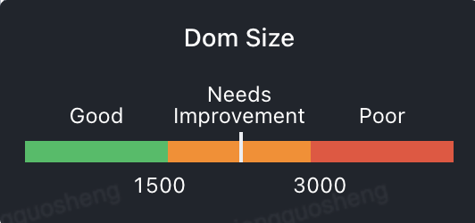

## Cumulative Layout Shift (CLS)
CLS 代表视觉稳定性，根据页面加载过程中视窗所有布局位置有变动的元素数量来计算值（越低越好）。

指标基准线：

# First Contentful Paint (FCP)
FCP 为首次有内容渲染的时间点。也就是浏览器首次加载字体、非白色 canvas 或 svg 图像时。

指标基准线：

# Largest Contentful Paint (LCP)
LCP 代表在 viewport 中最大的页面元素加载的时间。

指标基准线：

# First Input Delay (FID)
FID 代表首次输入延迟。FID 衡量的是从用户首次与网站进行交互（即当他们单击链接，点击按钮或使用自定义的 JavaScript 驱动的控件）到浏览器实际上能够响应该交互之间的时间。

# Speed Index (SI)
Speed Index 用于衡量衡量页面内容填充的速度。它特别适用于比较不同页面之间的差别。

指标基准线

# First Meaningful Paint (FMP)
FMP 首次有意义渲染耗时，代表页面主体元素首次出现的时间。相较于 FP、FCP 它更强调用户的主观感受，也就是我们通常看到的 “页面加载出来” 的状态。

指标基准线：

# Time to Interactive（TTI）
TTI 可交互时间。它用于标记应用已进行视觉渲染并能可靠响应用户输入的时间点。

指标基准线：

# Total Blocking Time（TBT)
TBT 页面阻塞总时长。TBT 汇总所有加载过程中阻塞用户操作的时长，在 FCP 和 TTI 之间任何 long task 中阻塞部分（超过 50ms 的时间长度）都会被汇总。

指标基准线：

# Time to First Byte (TTFB)
浏览器从请求页面开始到接收第一字节的时间，这个时间段内包括 DNS 查找、TCP 连接和 SSL 连接。

指标基准线：

# DOM Size
DOM Size 代表页面 DOM 节点数量。

指标基准线：
