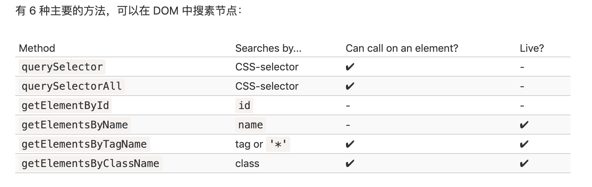

## DOM (Document Object Modal)
DOM, 将所有页面内容表示为可以修改的对象。 DOM 规范不仅应用于浏览器，也可以用在咖啡机上等。

### 节点类型
一共有 12 种节点类型。实际上，我们通常用到的是其中的 4 种：

- document — DOM 的“入口点”。
- 元素节点 — HTML 标签，树构建块。
- 文本节点 — 包含文本。被标记为 #text。一个文本节点只包含一个字符串。它没有子项，并且总是树的叶子。
- 注释 — 有时我们可以将一些信息放入其中，它不会显示，但 JS 可以从 DOM 中读取它。
HTML 节点：包含 HEAD、BODY 节点

#### a. 浏览器自动修正、补全、简化
1. 遇到不正确格式的的标签，例如 
 , 未闭合，则自动补全
2. 表格永远有 <tbody>。按照 DOM 规范，它们必须具有 <tbody>，但 HTML 文本却（官方的）忽略了它。然后浏览器在创建 DOM 时，自动地创建了 <tbody>。

请注意，开发者工具中的 DOM 结构是经过简化的。文本节点仅以文本形式显示。并且根本没有“空白”（只有空格）的文本节点。这其实挺好，因为大多数情况下，我们只关心元素节点。

#### b. 特殊符号
请注意文本节点中的特殊字符：

- 换行符：↵（在 JavaScript 中为 \n）
- 空格：␣

空格和换行符都是完全有效的字符，就像字母和数字。它们形成文本节点并成为 DOM 的一部分。所以，例如，在上面的示例中，\<head> 标签中的 \<title> 标签前面包含了一些空格，并且该文本变成了一个 #text 节点（它只包含一个换行符和一些空格）。

只有两个顶级排除项：

- 由于历史原因，<head> 之前的空格和换行符均被忽略。
- 如果我们在 </body> 之后放置一些东西，那么它会被自动移动到 body 内，并处于 body 中的最下方，因为 HTML 规范要求所有内容必须位于 <body> 内。所以 </body> 之后不能有空格。

### DOM 遍历
给定一个 DOM 节点，我们可以使用导航（navigation）属性访问其直接的邻居。

这些属性主要分为两组：

- 对于所有节点：parentNode，childNodes，firstChild，lastChild，previousSibling，nextSibling。
- 仅对于元素节点：parentElement，children，firstElementChild，lastElementChild，previousElementSibling，nextElementSibling。

### 查找 DOM

此外：

- elem.matches(css) 用于检查 elem 与给定的 CSS 选择器是否匹配。
- elem.closest(css) 用于查找与给定 CSS 选择器相匹配的最近的祖先。elem 本身也会被检查。

让我们在这里提一下另一种用来检查子级与父级之间关系的方法，因为它有时很有用：

- 如果 elemB 在 elemA 内（elemA 的后代）或者 elemA==elemB，elemA.contains(elemB) 将返回 true。