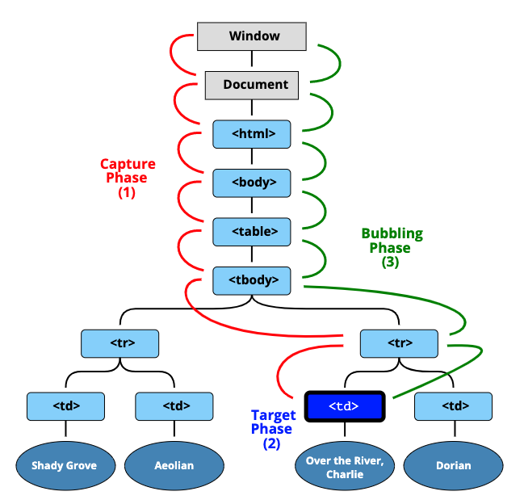

### 1. 分配事件处理程序的方式
1. HTML 特性（attribute）：onclick="..."。
2. DOM 属性（property）：elem.onclick = function。
3. 方法（method）：elem.addEventListener(event, handler[, phase]) 用于添加，removeEventListener 用于移除。

需要注意的一点是：
```
input.onclick = function() { alert(1); }
// ...
input.onclick = function() { alert(2); } // 替换了前一个处理程序
```
Web 标准的开发者很早就了解到了这一点，并提出了一种使用特殊方法 addEventListener 和 removeEventListener 来管理处理程序的替代方法。它们没有这样的问题。

### 2. 事件对象 event
为了正确处理事件，我们需要更深入地了解发生了什么。不仅仅是 “click” 或 “keydown”，还包括鼠标指针的坐标是什么？按下了哪个键？等等。

当事件发生时，浏览器会创建一个 event 对象，将详细信息放入其中，并将其作为参数传递给处理程序。

### 3. 事件
下面列举几个不太常用的事件

Document 事件：

- DOMContentLoaded —— 当 HTML 的加载和处理均完成，DOM 被完全构建完成时。
CSS 事件：

- transitionend —— 当一个 CSS 动画完成时。

event target 与 this（=event.currentTarget）之间的区别
- event.target —— 是引发事件的“目标”元素，它在冒泡过程中不会发生变化。
- this —— 是“当前”元素，其中有一个当前正在运行的处理程序。

### 4. 事件捕获 && 事件冒泡

bubbling: 当一个事件发生在一个元素上，它会首先运行在该元素上的处理程序，然后运行其父元素上的处理程序，然后一直向上到其他祖先上的处理程序。

**停止冒泡**

冒泡事件从目标元素开始向上冒泡。通常，它会一直上升到 \<html>，然后再到 document 对象，有些事件甚至会到达 window，它们会调用路径上所有的处理程序。

但是任意处理程序都可以决定事件已经被完全处理，并停止冒泡。

用于停止冒泡的方法是 event.stopPropagation()。

> 换句话说，event.stopPropagation() 停止向上移动，但是当前元素上的其他处理程序都会继续运行。

> 有一个 event.stopImmediatePropagation() 方法，可以用于停止冒泡，并阻止当前元素上的处理程序运行。使用该方法之后，其他处理程序就不会被执行。

**不要在没有需要的情况下停止冒泡！**
使用 event.stopPropagation() 可能会留下坑~

例如：我们要捕获在整个窗口上的点击，以追踪用户的行为（用户点击的位置）。有些分析系统会这样做。代码会使用 document.addEventListener('click'…) 来捕获所有的点击。
我们的分析不适用于被 stopPropagation 所阻止点击的区域。太伤心了，我们有一个“死区”。

可以通过自定义事件解决~


