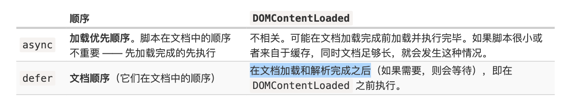

## 1. defer && async
现代的网站中，脚本往往比 HTML 更“重”：它们的大小通常更大，处理时间也更长。

当浏览器加载 HTML 时遇到 \<script>...\</script> 标签，浏览器就不能继续构建 DOM。它必须立刻执行此脚本。对于外部脚本 \<script src="...">\</script> 也是一样的：浏览器必须等脚本下载完，并执行结束，之后才能继续处理剩余的页面。

这会导致两个重要的问题：

脚本不能访问到位于它们下面的 DOM 元素，因此，脚本无法给它们添加处理程序等。
如果页面顶部有一个笨重的脚本，它会“阻塞页面”。在该脚本下载并执行结束前，用户都不能看到页面内容：

async 和 defer 有一个共同点：加载这样的脚本都不会阻塞页面的渲染。因此，用户可以立即阅读并了解页面内容。

但是，它们之间也存在一些本质的区别：



**动态脚本**
```
let script = document.createElement('script');
script.src = "/article/script-async-defer/long.js";
document.body.append(script); // (*)
```
默认情况下，动态脚本的行为是“异步”的，即 async;

如果我们显式地设置了 script.async=false，则可以改变这个规则。然后脚本将按照脚本在文档中的顺序执行，就像 defer 那样。

**总结**

在实际开发中，defer 用于需要整个 DOM 的脚本，和/或脚本的相对执行顺序很重要的时候。

async 用于独立脚本，例如计数器或广告，这些脚本的相对执行顺序无关紧要

## 2. HTML 生命周期
HTML 页面的生命周期包含三个重要事件：

- DOMContentLoaded —— 浏览器已完全加载 HTML，并构建了 DOM 树，但像 \ 和样式表之类的外部资源可能尚未加载完成。
- load —— 浏览器不仅加载完成了 HTML，还加载完成了所有外部资源：图片，样式等。
- beforeunload/unload —— 当用户正在离开页面时。

### a. DOMContentLoaded

DOM 树准备就绪 —— 这是它的触发条件。它并没有什么特别之处。

**遇到script怎么办？**

当浏览器处理一个 HTML 文档，并在文档中遇到 \<script> 标签时，就会在继续构建 DOM 之前运行它。这是一种防范措施，因为脚本可能想要修改 DOM，甚至对其执行 document.write 操作，所以 DOMContentLoaded 必须等待脚本执行结束。

**script太大，阻塞 DOMContentLoaded？**

异步加载 script

**浏览器内建的自动填充**
Firefox，Chrome 和 Opera 都会在 DOMContentLoaded 中自动填充表单。

例如，如果页面有一个带有登录名和密码的表单，并且浏览器记住了这些值，那么在 DOMContentLoaded 上，浏览器会尝试自动填充它们（如果得到了用户允许）

## 3. window.onload
当整个页面，包括样式、图片和其他资源被加载完成时，会触发 window 对象上的 load 事件。可以通过 onload 属性获取此事件。

## 4. window.onunload

当访问者离开页面时，window 对象上的 unload 事件就会被触发。我们可以在那里做一些不涉及延迟的操作，例如关闭相关的弹出窗口。

有一个值得注意的特殊情况是发送分析数据。
### a. sendBeacon
```
let analyticsData = { /* 带有收集的数据的对象 */ };

window.addEventListener("unload", function() {
  navigator.sendBeacon("/analytics", JSON.stringify(analyticsData));
});
```
- 请求以 POST 方式发送。
- 我们不仅能发送字符串，还能发送表单以及其他格式的数据，在 Fetch 一章有详细讲解，但通常它是一个字符串化的对象。
- 数据大小限制在 64kb。

### fetch
```
window.onunload = function() {
  fetch('/analytics', {
    method: 'POST',
    body: "statistics",
    keepalive: true
  });
};
```
不过它有一些限制
- keepalive 请求的 body 限制为 64kb
- 此限制是被应用于当前所有 keepalive 请求的总和的。换句话说，我们可以并行执行多个 keepalive 请求，但它们的 body 长度之和不得超过 64KB。
