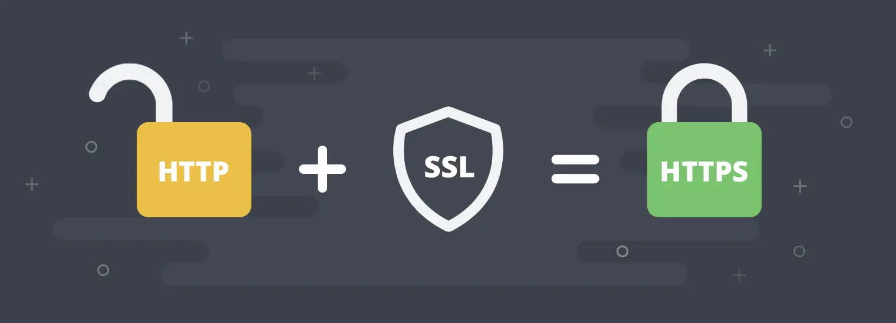

# HTTPS 原理浅析

# HTTP

在介绍 HTTPS 之前，我们先来回顾一下 HTTP 协议，HTTP 协议制定了互联网传输的标准，简化了直接使用 TCP 协议进行通信的难度。

虽然 less is more 的概念本身很好，但随着互联网的发展，过于简单的 HTTP 也会变得难以满足对安全性要求的不断提升。

## 通信使用明文（不加密），内容可能会被窃听

由于 HTTP 本身不具备加密的功能，所以也无法做到对通信整体（使用 HTTP 协议通信的请求和响应的内容）进行加密。即，HTTP 报文使用明文（指未经过加密的报文）方式发送。

## 不验证通信方的身份，因此有可能遭遇伪装

HTTP 协议中的请求和响应不会对通信方进行确认。也就是说任何人都可以发起请求。另外，服务器只要接收到请求，不管对方是谁都会返回一个响应，因此会存在以下隐患：

1. 无法确定请求发送至目标的 Web 服务器是否是按真实意图返回响应的那台服务器。有可能是已伪装的 Web 服务器。
2. 无法确定响应返回到的客户端是否是按真实意图接收响应的那个客户端。有可能是已伪装的客户端。
3. 无法确定正在通信的对方是否具备访问权限。因为某些 Web 服务器上保存着重要的信息，只想发给特定用户通信的权限。
4. 无法判定请求是来自何方、出自谁手。
5. 即使是无意义的请求也会照单全收。无法阻止海量请求下的 DoS 攻击（Denial of Service，拒绝服务攻击）。

## 无法证明报文的完整性，所以有可能已遭篡改

由于 HTTP 协议无法证明通信的报文完整性，因此，在请求或响应送出之后直到对方接收之前的这段时间内，即使请求或响应的内容遭到篡改，也没有办法获悉。换句话说，没有任何办法确认，发出的请求/响应和接收到的请求/响应是前后相同的。

# 什么是安全

通过上面的描述，既然 HTTP 不安全，那什么样的通信过程才是安全的呢?
通常认为，如果通信过程具备了四个特性，就可以认为是**安全**的，这四个特性是：机密性、完整性、身份认证和不可否认。

## 机密性（Secrecy/Confidentiality）

是指对数据的保密，只能由可信的人访问，对其他人是不可见的秘密，无需担心被窃听。

## 完整性（Integrity，也叫一致性）

是指客户端和服务器的数据在传输过程中不会被窜改。

## 身份认证（Authentication）

是指确认对方的真实身份，也就是**证明你真的是你**，保证消息只能发送给可信的人。

## 不可否认（Non-repudiation/Undeniable）

也叫不可抵赖，意思是不能否认已经发生过的行为，不能说话不算数。

# HTTPS

HTTPS 为 HTTP 提供了上面提到了安全的四大特性。

- HTTP Secure/HTTP over SSL/HTTP over TLS
- HTTPS 的定义：在 HTTP 之下增加的一个安全层，用于保障 HTTP 的加密传输。简而言之，所谓 HTTPS，其实就是身披 SSL 协议这层外壳的 HTTP。
- HTTPS 的本质：在客户端和服务器之间用非对称加密协商出一套对称密钥，每次发消息之前设内容加密，收到消息之后解密, 达到内容加密传输

## SSL/TLS

- SSL，即安全套接字层(Secure Socket Layer)，在 OSI 模型中处于第 5 层（会话层），是一种能够在服务器、machines 和通过网络运行的应用程序之间提供身份认证和数据加密的加密协议。
- SSL 是独立于 HTTP 的协议，所以不光是 HTTP 协议，其他运行在应用层的 SMTP 和 Telnet 等协议均可配合 SSL 协议使用。可以说 SSL 是当今世界上应用最为广泛的网络安全技术。
- SSL 发展到 v3 时已经证明了它自身是一个非常好的安全通信协议，于是互联网工程组 IETF 在 1999 年把它改名为 TLS（传输层安全，Transport Layer Security），正式标准化，版本号从 1.0 重新算起，所以 TLS1.0 实际上就是 SSLV3.1。
- TLS/SSL 的功能实现主要依赖于三类基本算法：散列函数、对称加密和非对称加密，利用非对称加密实现身份认证和密钥协商，对称加密算法采用协商的密钥对数据加密，基于散列函数验证信息的完整性。

## HTTPS 通信过程

### 1. 加密

实现机密性的最常规手段就是加密，加密算法一般分为两种：

#### 对称加密

加密与解密的密钥相同。

- **i. DES**：Data Encryption Standard（数据加密标准），DES 加密算法是一种分组密码，以 64 位为分组对数据加密，它的密钥长度是 56 位，加密解密用同一算法 。
- **ii. AES**：Advanced Encryption Standard（高级加密标准），该加密算法采用对称分组密码体制，密钥长度的最少支持为 128、192、256，分组长度 128 位，算法应易于各种硬件和软件实现。这种加密算法是美国联邦政府采用的区块加密标准，AES 标准用来替代原先的 DES，已经被多方分析且为全世界所使用。

对称加密的问题在于：如何才能安全地把密钥传递给对方，即密钥交换？由此引出我们的非对称加密。

#### 非对称加密

加密与解密的密钥不相同。

- 它有两个密钥，一个叫公钥（public key），一个叫私钥（private key） 。两个密钥是不同的，不对称，公钥可以公开给他人使用，而私钥必须严格保密。
- **ii. 公钥和私钥有个特别的单向性**：虽然都可以用来加密解密，但公钥加密后只能用私钥解密，私钥加密后也只能用公钥解密。
- **iii. RSA 加密算法**：是目前最有影响力的公钥加密算法，并且被普遍认为是目前最优秀的公钥方案之一。RSA 是第一个能同时用于加密和数字签名的算法，它能够抵抗到目前为止已知的所有密码攻击，已被 ISO 推荐为公钥数据加密标准。RSA 加密算法基于一个十分简单的数论事实：将两个大素数相乘十分容易，但想要对其乘积进行因式分解却极其困难，因此可以将乘积作为加密密钥。
- **iv. ECC 加密算法（Elliptic curve cryptography）**：是在 1985 年由 N.Koblitz 和 Miller 提出的将椭圆曲线用于密码算法，根据是有限域上的椭圆曲线上的点群中的离散对数问题（ECDLP）。ECDLP 是比因子分解问题更难的问题，它是指数级的难度。

#### 混合加密

- 那么我们是否可以直接抛弃对称加密，直接使用非对称加密来实现数据的安全传输？

- 答案是否定的。非对称加密算法都是基于复杂的数学难题，运算速度都非常慢，即便是 ECC 相较于 AES，运算速度都差上好几个数量级。如果因为安全，导致通信速度大幅下降，那就得不偿失了。
- 因此，HTTPS 采用对称加密和非对称加密两者并用的混合加密机制，在交换密钥环节使用非对称加密方式，之后的建立通信交换报文阶段则使用对称加密方式。
- 公开密钥加密处理起来比共享密钥加密方式更为复杂，因此若在通信时使用公开密钥加密方式，效率就很低。

### 2. 完整性

#### 摘要算法

- 实现完整性的手段主要是摘要算法（Digest Algorithm），也就是常说的散列函数、哈希函数（Hash Function）。任何消息经过散列函数处理后，都会获得唯一的散列值，这一过程称为消息摘要，其散列值称为数字指纹。
- 摘要算法有一些独特的特点：
  - i. 无论输入的消息有多长，计算出来的消息摘要的长度总是固定的。
  - ii. 消息摘要看起来是“随机的”。这些比特看上去是胡乱的杂凑在一起的，可以用大量的输入来检验其输出是否相同，一般，不同的输入会有不同的输出，而且输出的摘要消息可以通过随机性检验。一般地，只要输入的消息不同，对其进行摘要以后产生的摘要消息也必不相同；但相同的输入必会产生相同的输出。
  - iii. 消息摘要函数是单向函数，即只能进行正向的信息摘要，而无法从摘要中恢复出任何的消息，甚至根本就找不到任何与原信息相关的信息。
  - iv. 好的摘要算法，没有人能从中找到“碰撞”或者说极度难找到，虽然“碰撞”是肯定存在的（碰撞即不同的内容产生相同的摘要）。
- 消息摘要算法主要分为三大类：

  - i. MD（Message Digest，消息摘要算法）：MD 系列算法包括 MD2、MD4 和 MD5 共 3 种算法。
  - ii. SHA-1（Secure Hash Algorithm，安全散列算法）：SHA 算法主要包括其代表算法 SHA-1 和 SHA-1 算法的变种 SHA-2 系列算法（包含 SHA-224、SHA-256、SHA-384 和 SHA-512）。
  - iii. MAC（Message Authentication Code，消息认证码算法）：MAC 算法综合了上述两种算法，主要包括 HmacMD5、HmacSHA1、HmacSHA256、HmacSHA384 和 HmacSHA512 算法 。

- 摘要算法保证了数字摘要和原文是完全等价的。所以，我们只要在原文后附上它的摘要，就能保证数据的完整性。不过摘要算法不具有机密性，如果明文传输，那么黑客可以修改消息后把摘要也一起改了，网站还是鉴别不出来。

### 数字签名

加密算法结合摘要算法，我们的通信过程可以说是比较安全了。但这里还有漏洞，就是通信的两个端点，我们无法判定请求是来自何方、出自谁手。

生活中，解决身份认证的手段是签名和印章。通过这些，我们就能确定一个人的身份。对应到 TLS 里，有什么东西和现实中的签名、印章很像，只能由本人持有，而其他任何人都不会有呢？只要用这个东西，就能够在数字世界里证明你的身份。

很容易想到我们上面提到非对称加密里的私钥。使用私钥再加上摘要算法，就能够实现数字签名，同时实现身份认证和不可否认。

**如何实现呢？**

数字签名的原理其实很简单，私钥加密、公钥解密。签名相关环节主要在上面流程图中的 “判断证书” 这一步涉及.

服务器返回的证书是由证书颁发机构（CA）用其私钥进行签名的。浏览器在 “判断证书” 环节，会使用 CA 的公钥去验证证书上的签名是否有效。若签名验证通过，说明证书是由合法 CA 颁发且未被篡改，可确认服务器公钥的真实性；若签名验证不通过，就会给出警告提示。这一步虽未明确画出签名验证动作，但本质上是在验证 CA 对证书的签名 。

- 因为非对称加密效率太低，所以私钥只加密原文的摘要，这样运算量就小的多，而且得到的数字签名也很小，方便保管和传输。
- 签名和公钥一样完全公开，任何人都可以获取。但这个签名只有用私钥对应的公钥才能解开，拿到摘要后，再比对原文验证完整性，就可以像签署文件一样证明消息确实是你发的。
