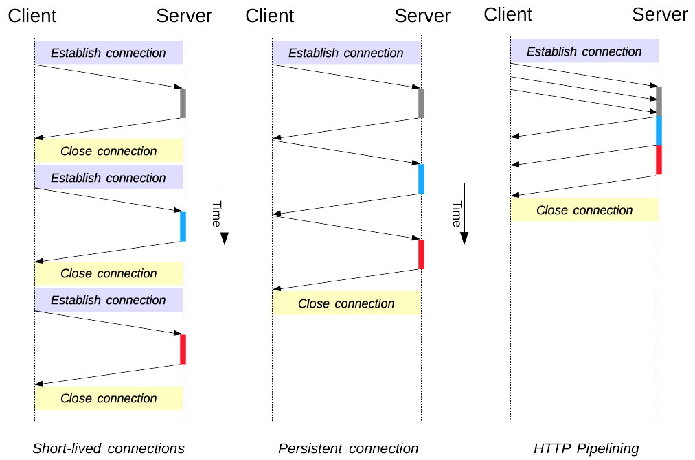
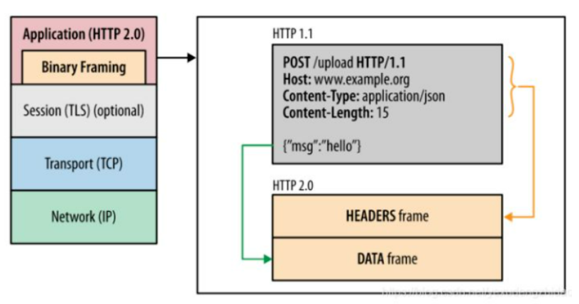
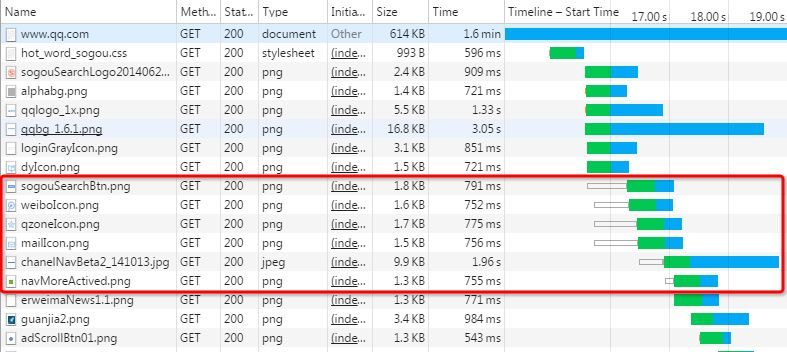
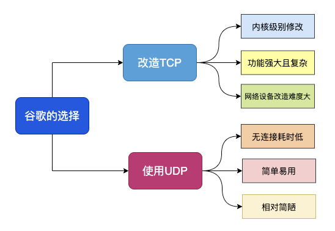
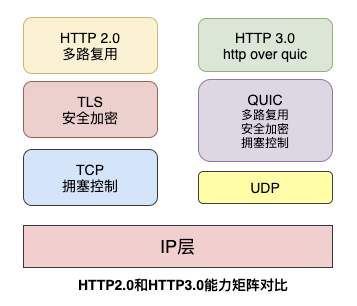

## HTTP/1.x 的连接管理
HTTP 的传输协议主要依赖于 TCP 来提供从客户端到服务器端之间的连接。在早期，HTTP 使用一个简单的模型来处理这样的连接。这些连接的生命周期是短暂的：每发起一个请求时都会创建一个新的连接，并在收到应答时立即关闭。

这个简单的模型对性能有先天的限制：打开每一个 TCP 连接都是相当耗费资源的操作。

有两个新的模型在 HTTP/1.1 诞生了。首先是长连接模型，它会保持连接去完成多次连续的请求，减少了不断重新打开连接的时间。然后是 HTTP 流水线模型，它还要更先进一些，多个连续的请求甚至都不用等待立即返回就可以被发送，这样就减少了耗费在网络延迟上的时间。

默认情况下，HTTP 请求是按顺序发出的。下一个请求只有在当前请求收到应答过后才会被发出。由于会受到网络延迟和带宽的限制，在下一个请求被发送到服务器之前，可能需要等待很长时间。那就可能会导致 Head of Line blocking (HOL) ，在下文会讲解在HTTP2.0中是如何解决的
## Http/2.0
HTTP/2 协议的主要目的是提高网页性能。同时在一定程度上，HTTP/2 还提升了 HTTP/1.x 安全性
### 1. 头部压缩
头信息（header）原来是直接传输文本，现在是压缩后传输

### 2. 二进制分帧
HTTP/2 中，通信的基本单位是帧，而不是之前的报文段。HTTP1.X 大部分时候使用了明文传输，所以很多时候黑客可以通过抓包报文的方式对于网络数据进行监控和尝试破解，为了安全传输数据，HTTP通常和TLS组合实现网络安全连接。

二进制帧是HTTP/2的“语法”变动，HTTP/2的传输格式由明文转为了二进制格式， 属于向 TCP/IP 协议“靠拢”，可以通过位运算提高效率。

二进制的格式虽然对于人阅读理解不是很友好，但是对于机器来说却刚好相反，实际上二进制传输反倒要比明文传输省事多了，因为二进制只有0和1绝对不会造成解析上的歧义，也不会因为编码问题需要额外转译。

二进制帧保留Header+Body传输结构，但是打散了内部的传输格式，把内容拆分为二进制帧的格式，HTTP/2把报文的基本传输单位叫做帧，而帧分为两个大类 HEADERS（首部） 和 DATA（消息负载），一个消息划分为两类帧传输同时采用二进制编码。

### 3. 多路复用
代替原来的序列和阻塞机制，如果想并发多个请求，必须使用多个 TCP 链接，且浏览器为了控制资源，还会对单个域名有 6-8个的TCP链接请求限制

在Http/2 中，同域名下所有通信都在单个连接上完成。如此一来，更可能会带来 HOL, 那如何解决呢？ /*（以下描述仅代表个人观点）*/
- 请求id，每个请求都带上独一无二的标识
- 序列号，HTTP/2 中，同域名下所有通信都在单个连接上完成，该连接可以承载任意数量的双向数据流。每个数据流都以消息的形式发送，而消息又由一个或多个帧组成。多个帧之间可以乱序发送，根据帧首部的流标识可以重新组装。（类似于 Tcp 中的序列号）

可以说在一定程度上，这个是通过浪费性能，解决 HOL 问题

总结：
- 同个域名只需要占用一个 TCP 连接，消除了因多个 TCP 连接而带来的延时和内存消耗。
- 单个连接可以承载任意数量的双向数据流
- 数据流以消息的形式发送，而消息又由一个或多个帧组成，多个帧之间可以乱序发送，因为根据帧首部的流标识可以重新组装。

### 4. Server push
访问一个网页，一般是需求分别发送请求，去请求HTML、CSS、JS，那么可能会有什么问题呢？
- 至少需要三轮 HTTP 通信
- 如果样式文件响应慢，会网页无样式，这个阶段一旦超过2秒，用户体验就会非常不好

可以理解为是RTT（Round Trip Time，也就是一个数据包从发出去到回来的时间） 问题，那么有没有好的方式去解决呢？

Server Push来喽~

不过，需要开发者自己配置。不过在实际开发中也遇到了一些其他问题~

**浏览器缓存 VS Server Push**

比如有，网站资源大小分别问，html文件 1k，css文件 1k, js 1.2M。此时，js、css 资源已经在浏览器缓存，当我们请求 html 资源时，推送回了我们不需要的js、css资源，从而在成宽带的浪费，所以需要了解浏览器缓存了哪些资源

### 总结
需要注意的是，在网络环境比较差的环境下，Http/2 有可能会比 Http/1 体验要差，因为Http/1 中，可以开多个Tcp连接
## QUIC协议和HTTP3.0
谷歌为什么选择UDP？

HTTP3.0又称为HTTP Over QUIC，其弃用TCP协议，改为使用基于UDP协议的QUIC协议来实现。

QUIC协议必须要实现HTTP2.0在TCP协议上的重要功能，同时解决遗留问题，我们来看看QUIC是如何实现的。

### a. 队头阻塞问题
队头堵塞 Head-of-line blocking(缩写为HOL blocking)是计算机网络中是一种性能受限的现象，通俗来说就是：一个数据包影响了一堆数据包，它不来大家都走不了。

HTTP2.0协议的多路复用机制解决了HTTP层的队头阻塞问题，但是在TCP层仍然存在队头阻塞问题。

TCP协议在收到数据包之后，这部分数据可能是乱序到达的，但是TCP必须将所有数据收集排序整合后给上层使用，如果其中某个包丢失了，就必须等待重传，从而出现某个丢包数据阻塞整个连接的数据使用。

QUIC协议是基于UDP协议实现的，在一条链接上可以有多个流，流与流之间是互不影响的，当一个流出现丢包影响范围非常小，从而解决队头阻塞问题。

### b. 0 RTT 建链
衡量网络建链的常用指标是RTT Round-Trip Time，也就是数据包一来一回的时间消耗。

【参考】https://network.51cto.com/art/202009/625999.htm
## TCP
关于TCP，除了三次握手、四次挥手，我们应该了解
- 拥塞控制：为防止网络瘫痪，在通信一开始就会通过一个叫慢启动的算法得出的数值，对数据量进行控制。过程中，会根据确认应答数，不断调整拥塞窗口的大小。有点像是“君子协议”
- 流量控制：这种机制让发送端根据接收端的实际接收能力控制发送数量。如果说拥塞控制是“君子协议”，那么不得不说，流量控制，就是法律，不得不遵从

补充下，猜想为什么“迅雷”下载资源会快呢？猜想
- 服务器，多 TCP
- 多 TCP 增加了滑动窗口

