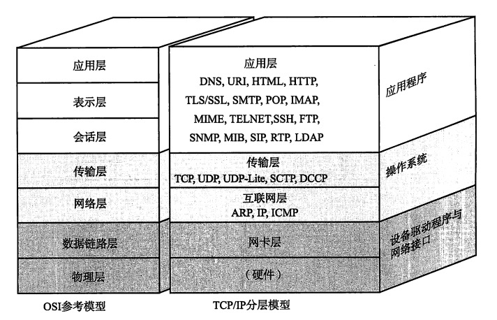
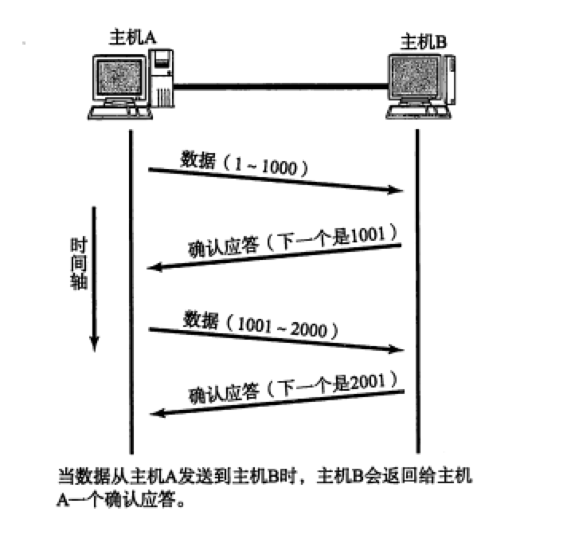
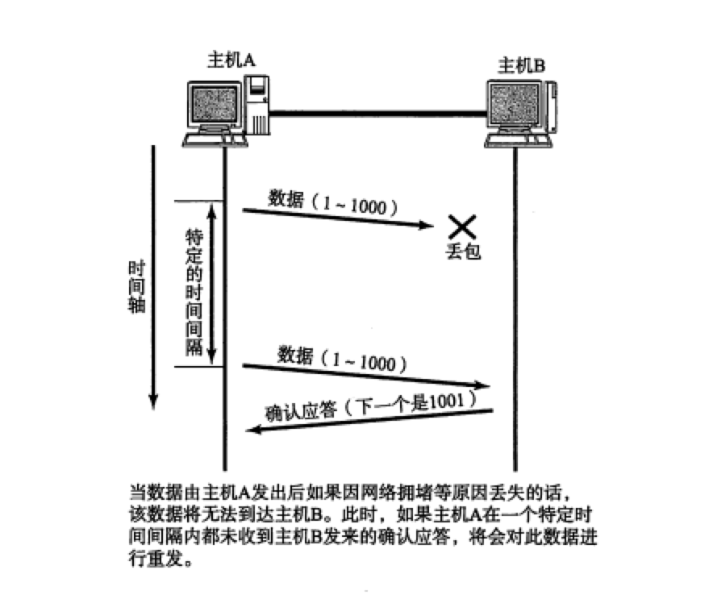
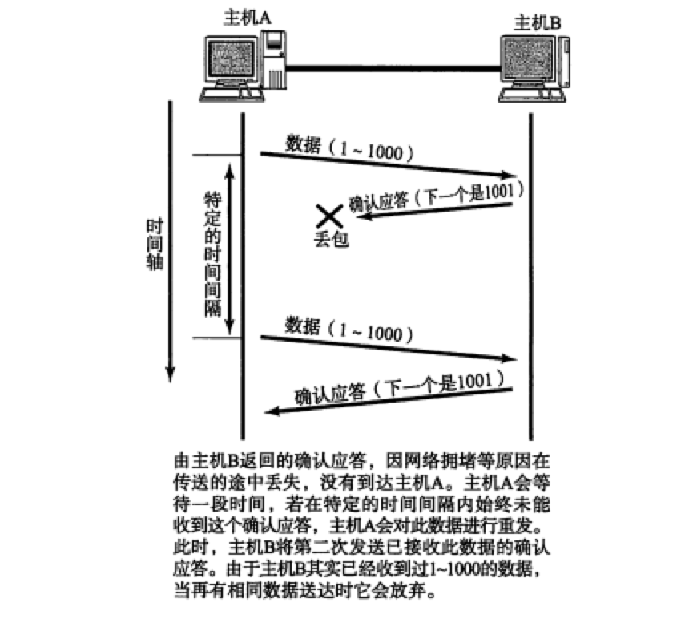
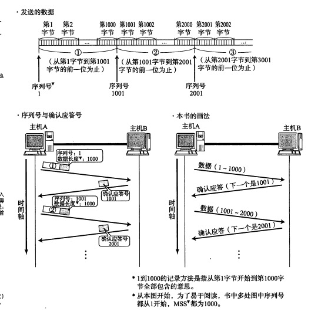
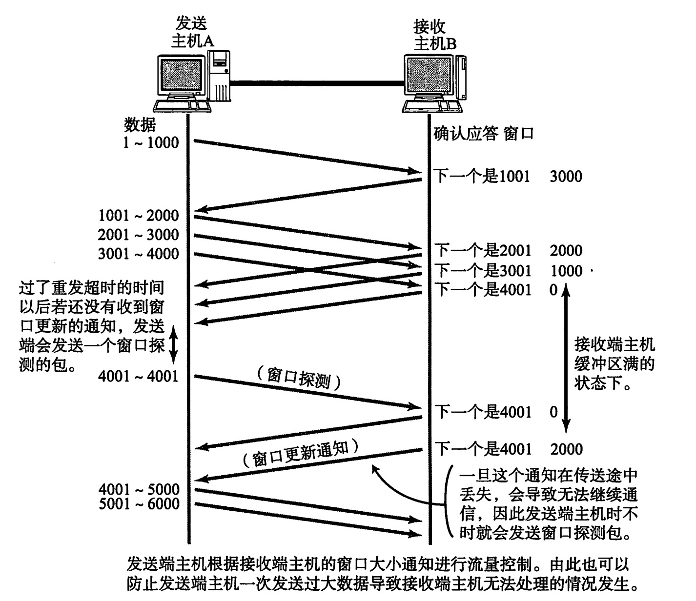
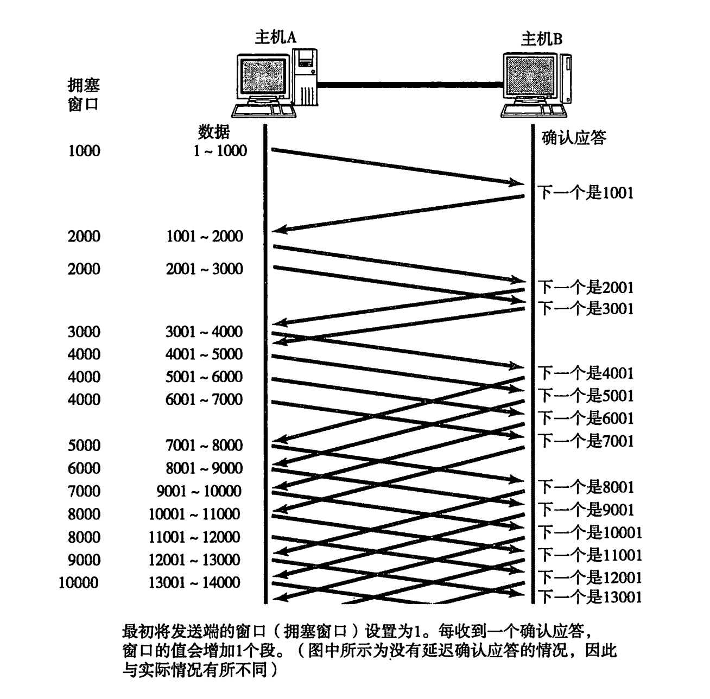

### Tcp 与 OSI 参考模型

## UDP vs TCP

## UDP
6.4.9
UDP是User Datagram Protocol的缩写。
UDP不提供复杂的控制机制，利用IP提供面向无连接的通信服务。并且它是
将应用程序发来的数据在收到的那一刻， 立即按照原样发送到网络上的一种机制。
即使是出现网络拥堵的情况下，UDP也无法进行流量控制等避免网络拥塞的
行为。此外，传输途中即使出现丢包，UDP也不负责重发。甚至当出现包的到达.
顺序乱掉时也没有纠正的功能。如果需要这些细节控制，那么不得不交由采用
UDP的应用程序去处理

## TCP 
为了通过 Ip 数据报实现可靠性传输，需要考虑很多事情，例如数据的破坏、丢包、重复以及分片顺序混乱等问题。如不能解决这些问题，也就无从谈起可靠传输

TCP 通过检验和、序列号、确认应答、重发机制、连接管理以及窗口控制等机制实现可靠性传输

**确认应答**

**重发**

**序列号**

未收到确认应答并不意味着数据-定丢失。也有可能是数据对方已经收到,
只是返回的确认应答在途中丢失。这种情况也会导致发送端因没有收到确认应答，
而认为数据没有到达目的地，从而进行重新发送。如图所示。

此外，也有可能因为一些其他原因导致确认应答延迟到达，在源主机重发数
据以后才到达的情况也履见不鲜。此时，源发送主机只要按照机制重发数据即可。
但是对于目标主机来说，这简直是-种“灾难”。它会反复收到相同的数据。而
为了对上层应用提供可靠的传输，必须得放弃重复的数据包。为此，就必须引人
一种机制，它能够识别是否已经接收数据，又能够判断是否需要接收。

### 流控制
发送端根据自己的情况发送数据。但是，接收端可能收到的是一个毫无关系的数据包有可能会在处理其他问题上花费一些时间，甚至在高负荷的情况下无法接受任务数据。如此一来，如果接受端将本应该接接收的数据丢弃掉的话，就又会出发重发机制，从而导致网络流量的无端浪费

为了解决这种现象发生，TCP 提供了一种机制可以让发送端根据接收端的能力控制发送的数据量，这就是所谓的流控制。具体操作就是接收端主动发送可以接收的数据的大小，于是发送端发送的数据不会超过这个小小。该大小被称作窗口大小

### 拥塞控制
有了TCP的窗口控制，收发主机之间即使不再以一个数据段为单位发送确认
应答，也能够连续发送大量数据包。然而，如果在通信刚开始时就发送大量数据,
也可能会引发其他问题。

一般来说，计算机网络都处在一一个共享的环境。因此也有可能会因为其他主
机之间的通信使得网络拥堵。在网络出现拥堵时，如果突然发送一个较大量的数
据，极有可能会导致整个网络的瘫瘓。

TCP为了防止该问题的出现，在通信一开始时就会通过--个叫做慢启动的算
法得出的数值，对发送数据量进行控制。

首先，为了在发送端调节所要发送数据的量，定义了一个叫做“拥塞窗口”
的概念。于是在慢启动的时候，将这个拥塞窗口的大小设置为1个数据段
(1MSS)▼发送数据， 之后每收到- - 次确认应答( ACK),拥塞窗口的值就加1。
在发送数据包时，将拥塞窗口的大小与接收端主机通知的窗口大小做比较，然后
按照它们当中较小那个值，发送比其还要小的数据量。
如果重发采用超时机制，那么拥塞窗口的初始值可以设置为1以后再进行慢
启动修正。有了。上述这些机制，就可以有效地减少通信开始时连续发包'导致的
网络拥堵，还可以避免网络拥塞情况的发生。
不过，随着包的每次往返，拥塞窗口也会以1、2、4等指数函数的增长，拥
堵状况激增甚至导致网络拥塞的发生。为了防止这些，引入了慢启动阀值的概念。
只要拥塞窗口的值超出这个阀值，在每收到--次确认应答时，只允许以下面这种
比例放大拥塞窗口:

(1个数据段的字节数 / 拥塞窗口(字节)) * 1个数据段的字节数 