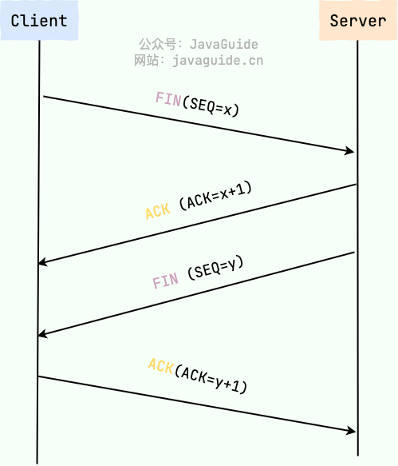

# 断开连接-TCP 四次挥手

断开一个 TCP 连接则需要“四次挥手”，缺一不可：

- 第一次挥手：客户端发送一个 FIN（SEQ=x） 标志的数据包->服务端，用来关闭客户端到服务端的数据传送。然后客户端进入 FIN-WAIT-1 状态。
- 第二次挥手：服务端收到这个 FIN（SEQ=X） 标志的数据包，它发送一个 ACK （ACK=x+1）标志的数据包->客户端 。然后服务端进入 CLOSE-WAIT 状态，客户端进入 FIN-WAIT-2 状态。
- 第三次挥手：服务端发送一个 FIN (SEQ=y)标志的数据包->客户端，请求关闭连接，然后服务端进入 LAST-ACK 状态。
- 第四次挥手：客户端发送 ACK (ACK=y+1)标志的数据包->服务端，然后客户端进入TIME-WAIT状态，服务端在收到 ACK (ACK=y+1)标志的数据包后进入 CLOSE 状态。此时如果客户端等待 2MSL 后依然没有收到回复，就证明服务端已正常关闭，随后客户端也可以关闭连接了。只要四次挥手没有结束，客户端和服务端就可以继续传输数据！

只要四次挥手没有结束，客户端和服务端就可以继续传输数据！

## 为什么要四次挥手？

TCP 是全双工通信，可以双向传输数据。任何一方都可以在数据传送结束后发出连接释放的通知，待对方确认后进入半关闭状态。当另一方也没有数据再发送的时候，则发出连接释放通知，对方确认后就完全关闭了 TCP 连接。

举个例子：
A 和 B 打电话，通话即将结束后。
1. 第一次挥手：A 说“我没啥要说的了”第二次挥手：
2. B 回答“我知道了”，但是 B 可能还会有要说的话，A 不能要求 B 跟着自己的节奏结束通话
3. 第三次挥手：于是 B 可能又巴拉巴拉说了一通，最后 B 说“我说完了”
4. 第四次挥手：A 回答“知道了”，这样通话才算结束。

## 为什么不能把服务端发送的 ACK 和 FIN 合并起来，变成三次挥手？

因为服务端收到客户端断开连接的请求时，可能还有一些数据没有发完，这时先回复 ACK，表示接收到了断开连接的请求。等到数据发完之后再发 FIN，断开服务端到客户端的数据传送。

## 如果第二次挥手时服务端的 ACK 没有送达客户端，会怎样？
客户端没有收到 ACK 确认，会重新发送 FIN 请求。

## 为什么第四次挥手客户端需要等待 2*MSL（报文段最长寿命）时间后才进入 CLOSED 状态？

第四次挥手时，客户端发送给服务端的 ACK 有可能丢失，如果服务端因为某些原因而没有收到 ACK 的话，服务端就会重发 FIN，如果客户端在 2*MSL 的时间内收到了 FIN，就会重新发送 ACK 并再次等待 2MSL，防止 Server 没有收到 ACK 而不断重发 FIN。MSL(Maximum Segment Lifetime) : 一个片段在网络中最大的存活时间，2MSL 就是一个发送和一个回复所需的最大时间。如果直到 2MSL，Client 都没有再次收到 FIN，那么 Client 推断 ACK 已经被成功接收，则结束 TCP 连接。

> 参考：（TODO: rujunqiao）https://javaguide.cn/cs-basics/algorithms/classical-algorithm-problems-recommendations.html
