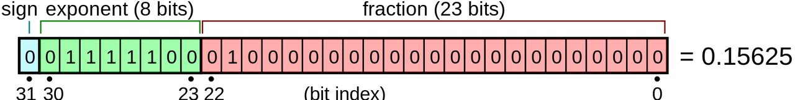
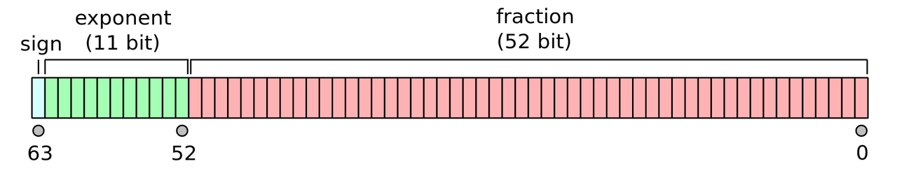
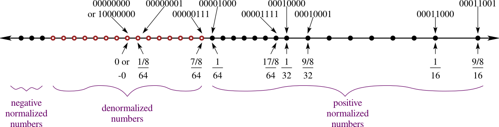
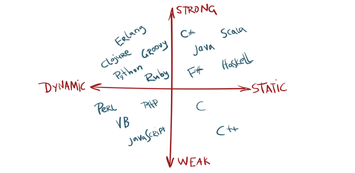
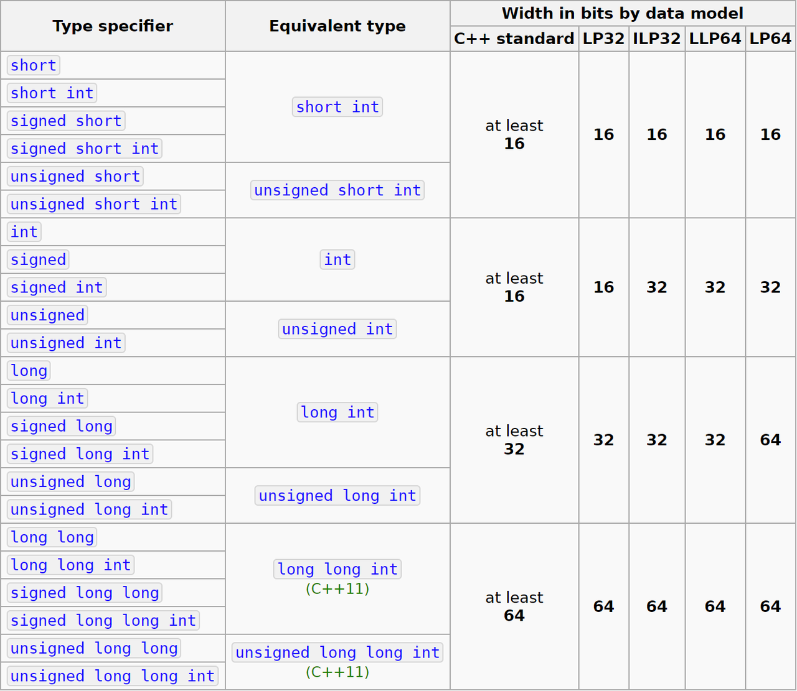
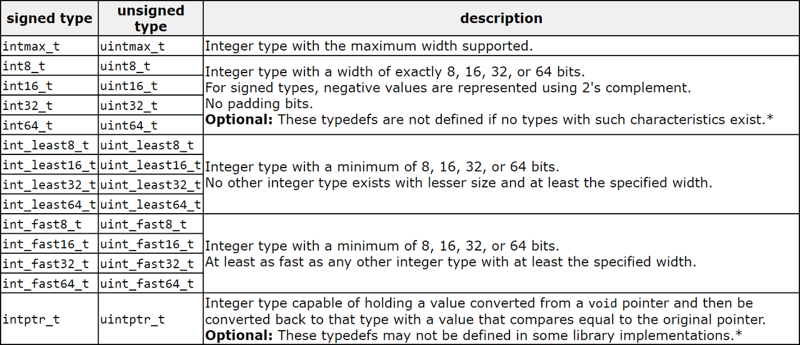

# 整数
## 整数与二进制位
- 计算机使用二进制存储和传输
  - 传输的最小单位是位（bit）
  - 存储的最小单位是字节（byte），1 字节 = 8 位
  - 整数 => 表达为二进制位 => 编码为字节
- 无符号整数
  - N 位无符号整数的范围：[0, 2**N - 1]
  - 最低位（least significant bit）编为 0 位（LSB 0）
  - 最高位（most significant bit）编为 N-1 位
- 有符号整数：负数如何表达？

#### 有符号整数的负数表达
> 注意：正数的原码、反码、补码一致

- 原码（signed magnitude）
  - 最高位取反，其他位不变
  - 缺点：0 有两种表示，加减运算复杂
- 反码（ones' complement）
  - 所有位取反：-x = ~x = 2**N - 1 - x = 111...111 - x（即：原码符号位除外，其他位按位取反）
  - 缺点：0 有两种表示，加法需要补上进位
  - 反码通常是用来由原码求补码或者由补码求原码的过渡码
- 补码（two's complement）
  - 所有位取反后加 1：-x = ~x + 1 = 2**N - x ≡ -x(mod 2**N)
- 余码（excess notation）：和补码的区别是符号位相反

|  二进制 | 无符号 | 原码   | 反码  | 补码  |
|  ----  | ----  | ----  | ----  | ---- |
| 000    | 0     | 0    | 0    | 0     |
| 001    | 1     | 1    | 1    | 1     |
| 010    | 2     | 2    | 2    | 2     |
| 011    | 3     | 3    | 3    | 3     |
| 100    | 4     | -0   | -3   | -4    | 
| 101    | 5     | -1   | -2   | -3    |
| 110    | 6     | -2   | -1   | -2    |
| 111    | 7     | -3   | -0   | -1    |

#### 补码（two's complement）的优点
- 0 只有一种表示，原码和反码有 0 和 -0
- 范围更大：[-2**(N-1), 2**(N-1) - 1]
  - 原码和反码的范围：[-2**(N-1) - 1, 2**(N-1) - 1]
- 加法简单（但取负数比反码多一步加 1）
  - 反码加法：
    - 2 + (-1) = 010 + 110 = 000(进位1) = 000 + 1 = 001 = 1
  - 补码加法：2 + (-1) = 010 + 111 = 001(进位1) = 1
- 补码和无符号整数的加法、减法、结果同位数的乘法是一样的
  - X86 指令集的 add/sub（加减法）指令不区分有符号和无符号

#### 位运算
- 对二进制位（高位在左）的操作，与字节序无关
- 以下以 Java 为例（ECMAScript 抄袭了 Java 的位运算符）
- ~：按位非（Complement）
- &：按位与（AND）
- |：按位或（OR）
- ^：按位异或（XOR）
- <<：按位左移（无符号左移结果一样），右边补 0
- \>>：按位右移，左边补符号位（最高位）
- \>>>：按位无符号右移，左边补 0

#### [字节序](./字节序.md)

# 浮点数
#### 定点数与浮点数
- 如何表达小数？
- 定点数：在整数的二进制位里加入固定的小数点
  - 例如 8 位的后 3 位为小数：00011.101 = 3.625
    - 最大数为 11111.111 = 255/8，最小正数为 1/8
    - 相当于整数除以常数，无法表达极大的数和极小的正数
- 浮点数：浮动的小数点
  - 二进制科学计数法：±1 * 1.fraction * 2**(exp - bias)
    - fraction（尾数）：1 <= 1.fraction < 2
    - exp - bias（指数）：exp >= 0，bias 是指数偏移常量
#### IEEE-754 浮点数标准
- 标准化了各种位数浮点数的二进制位，未标准化字节序
  - 总位数 = 1（最高位的符号位） + 指数位数 + 尾数位数
  - 单精度浮点数（32 位）：1+8+23，指数偏移为 127
  - 双精度浮点数（64 位）：1+11+52，指数偏移为 1023
- 标准化了规约数、非规约数、±0、±∞、NaN，以 32 位为例
  - 规约数（1<=exp<=254）：1.fraction * 2**(exp - 127)
  - 非规约数（exp=0, fraction>0）：0.fraction * 2**(-126)
  - ±0（exp=0, fraction=0）
  - ±∞（exp=255, fraction=0）NaN（exp=255, fraction>0）
  

#### 非规约数的作用
- 以 1+4+3、bias=7 的 8 位浮点数为例
  - 最小的正规约数 f1 = 1.000 * 2**(-7) = 1/64
  - 第二小的正规约数 f2 = 1.001 * 2**(-7) = (9/8)/64
  - f1 和 f2 之间的距离是 (1/8)/64
  - 但 0 和 f1 之间的距离是 1/64，密度突然变低
  - 非规约数可避免 0 和 最小的正规约数之间的密度突然降低
  - 下图中黑点为规约数，红点为非规约数
  
  

#### 浮点数的舍入误差
- 计算机只能表达离散值，无法表达所有实数
- 无法精确表达时只好舍入到最接近的值
- 默认的舍入策略：Round to nearest, ties to even
- 0.1 + 0.2 > 0.3，以 ECMAScript 为例（64 位浮点数）
  - (0.1).toString(2)
  - (0.2).toString(2)
  - (0.1 + 0.2).toString(2)
  - (0.3).toString(2)

#### 各种编程语言的数值类型
> There are only two kinds of languages: the ones people complain about and the ones nobody uses.
>——Bjarne Stroustrup

  

#### ECMAScript 数值类型
- **Number**：64 位浮点数（IEEE-754）
  - Number.MAX_SAFE_INTEGER == 2**53 - 1
    - 2**53 - 1 < 2**53 == 2**53 + 1 < 2**53 + 2
  - 却支持 32 位整数的位运算：~、&、|、^、<<、>>、>>>
    - 因此 asm.js 生成这种代码：a = a|0
  - V8 内部用 Smi 优化小整数的性能
- BigInt：无限精度的整数（ES2019），不能和 Number 混合运算
  - BigInt(2**53) < BigInt(2**53) + BigInt(1)
- 解析与编码：ArrayBuffer 配合 typed array objects 或 DataView

#### Python 数值类型
- Python2
  - int：C 语言的 long 类型，[-sys.maxint - 1, sys.maxint]
    - type(sys.maxint) != type(2**63 - 1)，为什么？
  - long：无限精度的整数
- Python3 合并为 int：无限精度的整数
- float：64 位浮点数，无法做位运算（这点比 ECMAScript 优雅）
- complex：两个 64 位浮点数，比如 z = 3+4j
- 混合运算运行期类型提升：int => long => float => complex
- 解析与编码：struct 的 pack 和 unpack 方法

#### Java 数值类型
- byte：8 位有符号整数
- short：16 位有符号整数
- int：32 位有符号整数，Java SE 8 之后同类型支持无符号
- long：64 位有符号整数，Java SE 8 之后同类型支持无符号
- 整数都使用补码表示，因此可同时支持有符号和无符号
- float：32 位浮点数
- double：64 位浮点数
- 混合运算编译期类型提升
- 解析与编码：ByteBuffer 的 getInt/putInt 等方法

#### C/C++ 数值类型
- 整数（32 位系统）
  - Win16：LP32 或 2/4/4（int 为 16 位，long 和指针为 32 位）
  - Win32 / Linux：ILP32 或 4/4/4（int、long 和指针为 32 位）
- 整数（64 位系统）
  - Win64：LLP64 或 4/4/8（int、long 为 32 位，指针为 64 位）
  - Linux：LP64 或 4/8/8（int 为 32 位，long 和指针为 64 位）
- 浮点数：float（32 位）double（64 位）long double（80 位）
- 整数表达跟随系统环境（原码、反码或补码），C++20 规范为补码
- 混合运算编译期类型提升
  
  
  

  #### 参考资料
- [什么是浮点数？](https://zhuanlan.zhihu.com/p/339949186)
- https://en.wikipedia.org/wiki/Signed_number_representations
- https://en.wikipedia.org/wiki/Endianness
- https://en.wikipedia.org/wiki/IEEE_754
- [Floating-point representation](http://www.toves.org/books/float/)
- [IEEE-754 Analysis](https://ysangkok.github.io/IEEE-754/index.xhtml)
- [What Every Computer Scientist Should Know About Floating-Point Arithmetic](https://docs.oracle.com/cd/E19957-01/806-3568/ncg_goldberg.html)
- [V8 Internals: How Small is a “Small Integer?”](https://medium.com/fhinkel/v8-internals-how-small-is-a-small-integer-e0badc18b6da)
- [BigInts in JavaScript: A case study in TC39](https://docs.google.com/presentation/d/1apPbAiv_-mJF35P31IjaII8UA6TwSynCA_zhfDEmgOE/edit)
