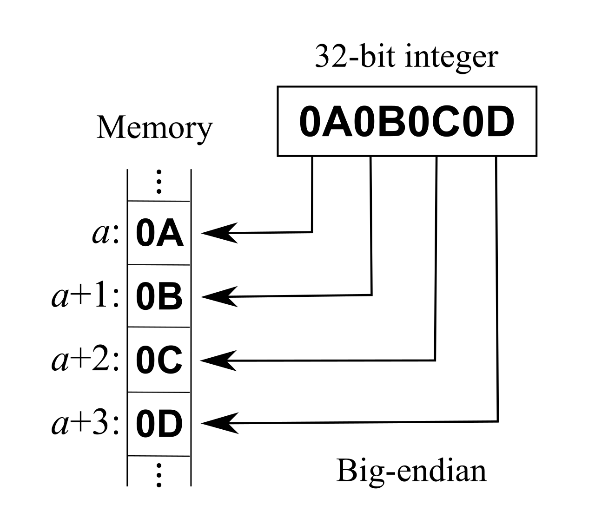
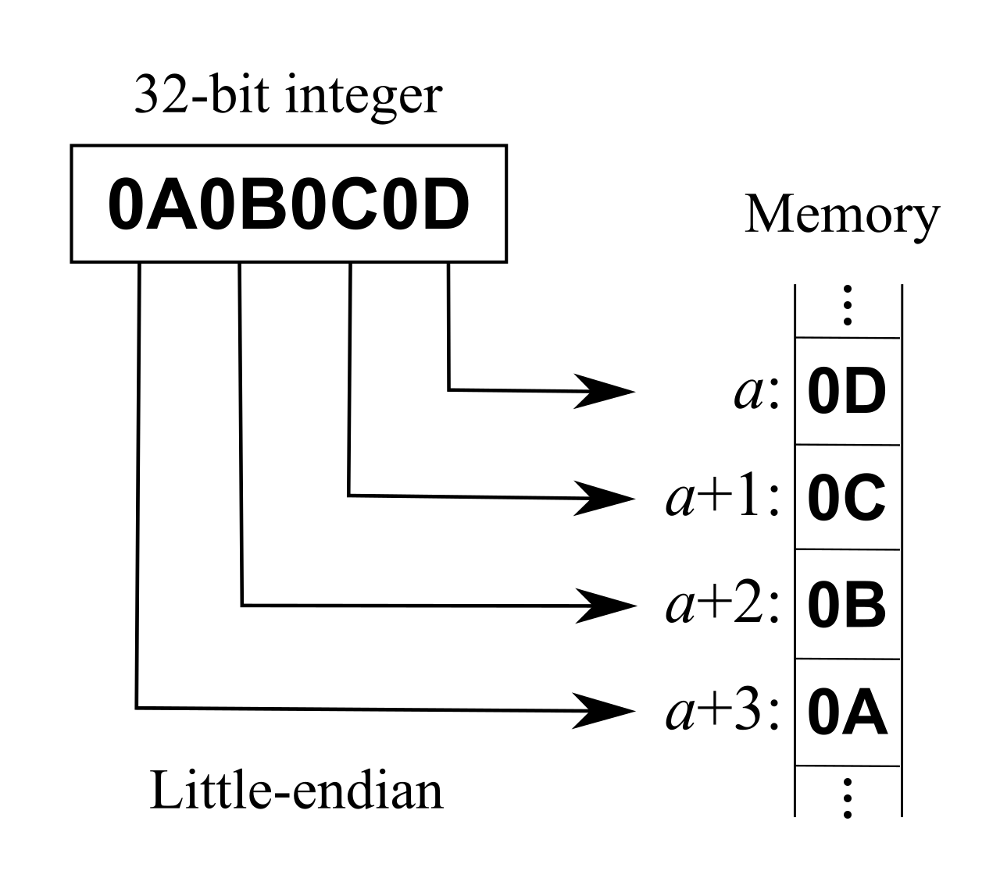
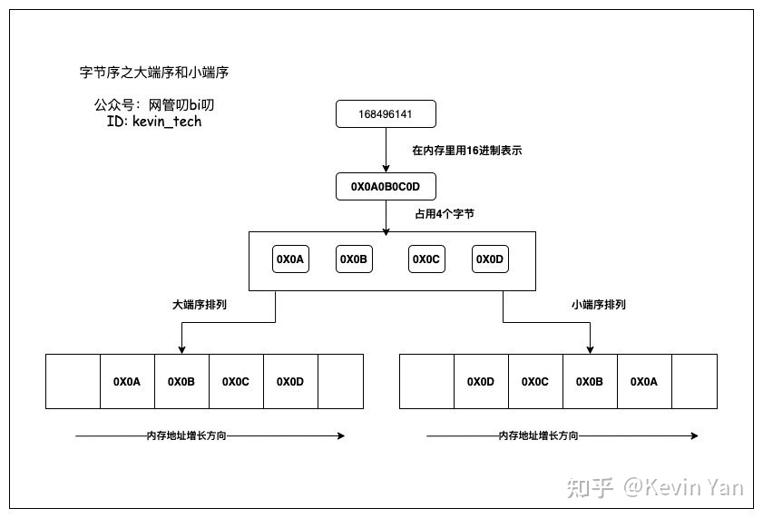

### 字节序（Endianness）
- 二进制位切为字节（最小可寻址单位）后存储的顺序
- 大端（big-endian、BE）
  - 高位字节（most significant byte）在前面（低地址）
  - 16 位无符号整数 0x1234 编码为 0x12、0x34
  - TCP/IP 协议广泛使用，也称网络序（network order）
- 小端（little-endian、LE）
  - 低位字节（least significant byte）在前面（低地址）
  - 16 位无符号整数 0x1234 编码为 0x34、0x12
  - X86 处理器和大多数 ARM 处理器采用小端

在内存中存放整型数值168496141 需要4个字节，这个数值的对应的16进制表示是0X0A0B0C0D，这个数值在用大端序和小端序排列时的在内存中的示意图如下：

